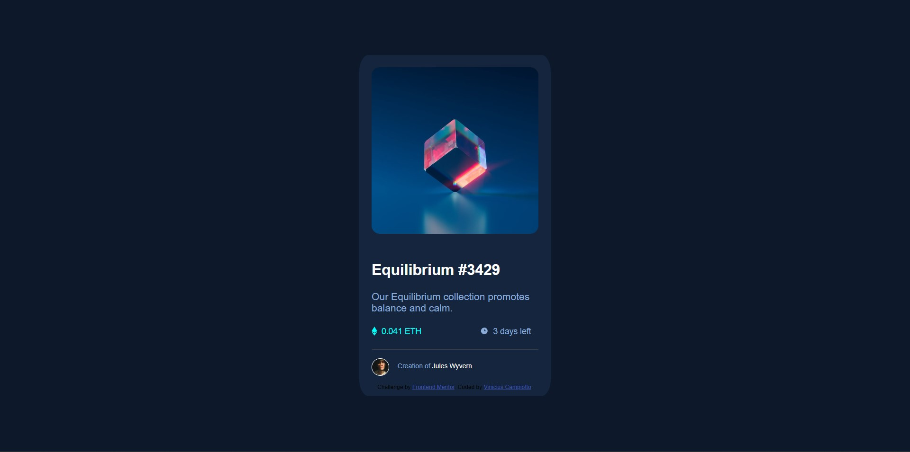

# Frontend Mentor - NFT preview card component solution

This is a solution to the [NFT preview card component challenge on Frontend Mentor](https://www.frontendmentor.io/challenges/nft-preview-card-component-SbdUL_w0U). Frontend Mentor challenges help you improve your coding skills by building realistic projects.

### The challenge

Users should be able to:

- View the optimal layout depending on their device's screen size
- See hover states for interactive elements

### Screenshot

### Links

- Solution URL: 

### Built with

- Semantic HTML5 markup
- CSS custom properties
- Flexbox
- Responsive Design.

### What I learned

- By developing this project, I was able to improve my skills with flex-box and use of svg, learned more aboute :hover and responsive design.

## Author

- Website - [Vinicius Campitto](https://github.com/Campiottocodes)
- Frontend Mentor - [@Campiottocodes](https://www.frontendmentor.io/profile/Campiottocodes)
